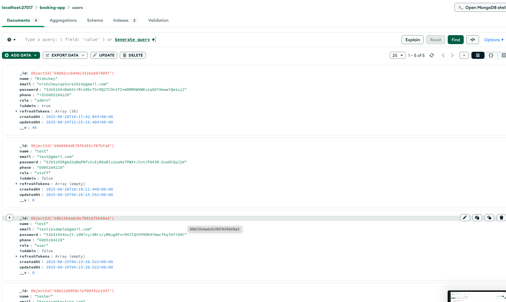
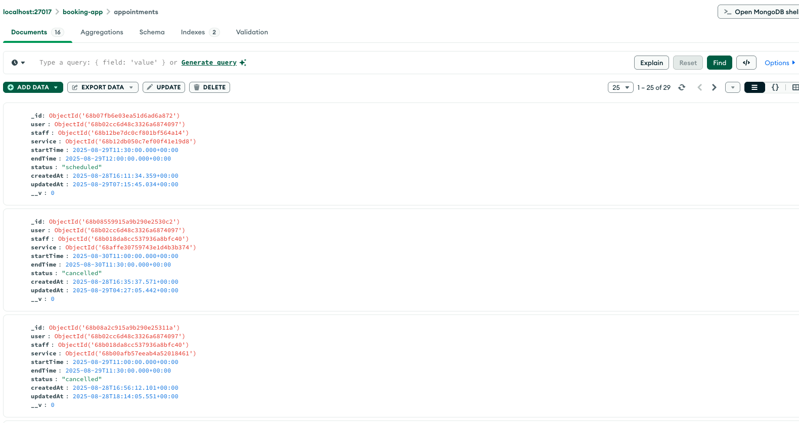
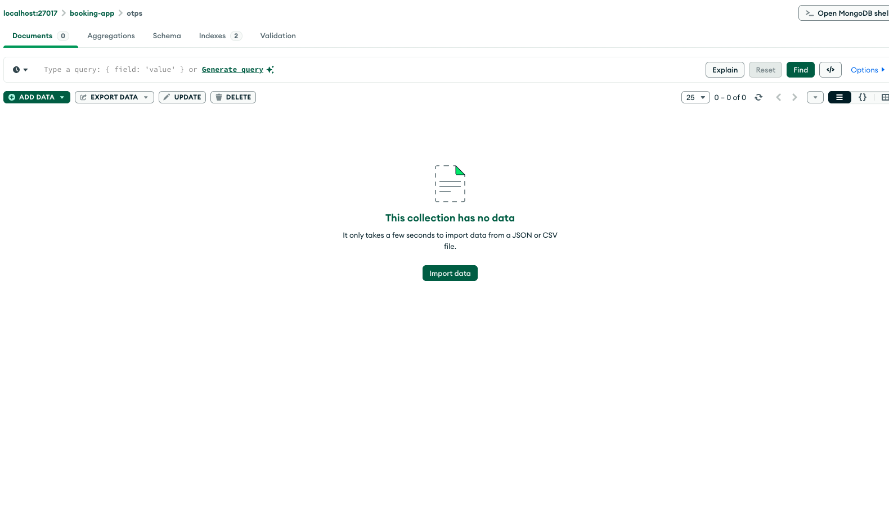

# Appointment Booking System

## Project Overview

This project is a fully-featured **Appointment Booking System** with role-based access control, real-time notifications, and a secure, scalable architecture. It provides seamless interactions for **customers**, **staff**, and **admins**, ensuring optimized performance, modern UI/UX, and robust security.

- Real-time updates and notifications for bookings, reschedules, and administrative actions.
- Prevention of double-booking with unique indexes.
- Optimized and responsive frontend with MUI, Tailwind, and RTK Query.
- Secure backend with JWT authentication, OTP verification, and role-based access control.
- Async job handling using **Bull Queue** and **Redis** for notifications.
- Full API documentation via **Swagger UI**.

**Demo Video:** [Watch Demo](https://drive.google.com/file/d/1HvOJSCgUAigSIv90B5fsuA30ZyV1B80U/view?usp=sharing)

### MongoDB Database









IT IS EMPTY BECAUSE ONCE VERFIED IT DELETE IT


---

## Features

### Theme Selection & System Theme Sync

- Users can switch between **light**, **dark**, and **system themes** using the `ThemeSelector` component.
- Automatic detection of the user's OS/system theme if 'system' is selected.
- Instant and global theme changes affecting all UI components (MUI + Tailwind).
- Theme preference is stored in Redux and persists across sessions.
- Includes smooth transitions and accessibility support.

### Role-Based Access

- Separate flows and permissions for **Admin**, **Staff**, and **Customer**.
- **Admin:** Full access to manage users, staff, services, appointments, and notifications.
- **Staff:** Manage own appointments and availability.
- **Customer:** Book, view, and reschedule appointments.

### 3-Way Notification System

- **In-App:** Real-time notifications with read/unread tracking and dropdown UI.
- **Email:** Sent via SMTP with customizable templates.
- **SMS:** Sent via Twilio for instant delivery.

### OTP-Based Forget Password

- OTP sent to the user for verification.
- Temporarily stored in the backend; deleted once verified.
- Verified users can securely reset their password.

### Appointment Booking & Rescheduling

- Customers can book, view, and reschedule appointments.
- Staff can view/manage their schedules.
- Customers and staff both receive **phone notifications and emails** for confirmations and reschedules.
- Double-booking prevention ensures a slot cannot be booked more than once.

### Admin Dashboard

- Manage users, staff, services, appointments, and notifications.
- Send **global or targeted notifications** via in-app, email, or SMS.
- View notification stats and track read/unread status.

### Security

- JWT authentication and role-based middleware.
- OTP for sensitive actions and password resets.
- Rate limiting, CORS protection, input validation, and secure password hashing.

### Modern Frontend

- Built with **React + MUI + Tailwind + RTK Query** for responsive and elegant UI.
- Card-based appointment display, dropdown time selection, skeleton loaders, and notification dropdowns.
- Custom loaders using **Lottie animations**.
- Error boundaries display errors with retry buttons and hard reload options.

### Scalable Backend

- **Node.js + Express + MongoDB** architecture.
- Async jobs handled with **Bull Queue** and **Redis**.
- Secure, modular, and optimized API endpoints.

### API Documentation

- Interactive **Swagger UI** available at `/api-docs` for exploring all endpoints.

### Optimizations

- React.memo, useCallback, modular components, and error boundaries.
- Custom loaders for better UX during API calls.
- Focus on security and performance.

### Additional Features

- Users cannot book the same slot twice.
- Skeleton loaders and custom error boundaries improve UX.
- Full logging for debugging and analytics.
- Easy to extend with new services or staff members.

**Demo Video:** [Watch Demo](Insert-Video-Link-Here)  
**Project Screenshot:**  


## Table of Contents

- [Overview](#overview)
- [Architecture](#architecture)
- [Features](#features)
- [Backend Deep Dive](#backend-deep-dive)
- [Frontend Deep Dive](#frontend-deep-dive)
- [Notification System (3-Way)](#notification-system-3-way)
- [Booking & Appointment Flow](#booking--appointment-flow)
- [Security & Middleware](#security--middleware)
- [Database Handling](#database-handling)
- [API Reference](#api-reference)
- [Frontend Auth & Security](#frontend-auth--security)
- [Admin Powers](#admin-powers)
- [Environment Variables](#environment-variables-env)
- [Setup & Running](#setup--running)
- [Troubleshooting](#troubleshooting)
- [License](#license)

## Overview

This is a robust, production-grade event/appointment booking platform with a focus on reliability, security, and user experience. It supports:

- Role-based access for admins, staff, and customers
- 3-way notifications (in-app, email, SMS)
- Modern frontend and scalable backend
- Secure authentication and data handling

---

## Architecture

**Monorepo** with clear separation:

- `/backend`: Node.js, Express, TypeScript, MongoDB, Bull, Redis
- `/frontend`: React, TypeScript, Vite, MUI, Tailwind, RTK Query

**Notification Flow:**

1. **Trigger**: Booking, reschedule, admin notification, etc.
2. **Enqueue**: Job added to Bull queue (email, SMS, in-app)
3. **Process**: Queue processor (separate process) sends email (SMTP), SMS (Twilio), and in-app notification (MongoDB)
4. **Delivery**: User receives notification in-app, via email, and via SMS

**Security:**

- JWT authentication, role-based middleware, validation, rate limiting, CORS

---

---

### 1. User Roles & Permissions

- **Admin**: Full control. Can manage users, staff, services, appointments, notifications, and view stats.
- **Staff**: Can view/manage their own appointments, receive notifications.
- **Customer**: Can book, view, and manage their own appointments, receive notifications.

### 1. User Roles & Permissions

### 2. Notification System (3-Way)

- **In-App Notification**: Real-time, unread/read tracking, delivered to dashboard.
- **Email Notification**: Sent via SMTP (configurable in `.env`).
- **SMS Notification**: Sent via Twilio (configurable in `.env`).
- **All notifications are queued and processed reliably using Bull and Redis.**

### 2. Notification System (3-Way)

#### Example: Appointment Booking

When a customer books or reschedules an appointment:

- **Customer and Staff** both receive:
  - In-app notification
  - Email
  - SMS
- Admin can view all notifications and stats.

---

- When a customer books or reschedules an appointment:

---

## Backend Deep Dive

- **Customer and Staff** both receive:

### Tech Stack

- Node.js, Express, TypeScript
- MongoDB (Mongoose ODM)
- Bull Queue + Redis (for async jobs)
- Nodemailer (Email), Twilio (SMS)

### Key Modules & Structure

- `users/` – User schema, role management, authentication, admin powers
- `appointment/` – Appointment schema, booking, rescheduling, reminders, double-booking prevention
- `notifications/` – Notification schema, service, controller, queue logic, read/unread tracking
- `common/services/` – Email, SMS, queue processors, helpers, validation

### Tech Stack

- Node.js, Express, TypeScript
- MongoDB (Mongoose ODM)
- Bull Queue + Redis (for async jobs)
- Nodemailer (Email), Twilio (SMS)

### Key Modules

- `users/` – User schema, role management, authentication
- `appointment/` – Appointment schema, booking, rescheduling, reminders

### Notification Flow (Code Snippet)

```ts
// Enqueue notification (in notification.service.ts or appointment.service.ts)
notificationQueue.add("sendNotificationEmail", { ... });
notificationQueue.add("sendNotificationSMS", { ... });
// In queueProcessors.ts
notificationQueue.process("sendNotificationEmail", async (job) => sendEmail(job.data));
notificationQueue.process("sendNotificationSMS", async (job) => sendSMS(job.data.to, job.data.body));
// In-app notification is created in MongoDB and delivered via API
```

- `notifications/` – Notification schema, service, controller, queue logic

---

## Booking & Appointment Flow

- **POST /appointments**: Authenticated users can book an appointment.
- **POST /appointments/availability**: Get available slots for staff/service/date.
- **PATCH /appointments/:id/reschedule**: Reschedule an appointment (with notification to all parties).
- **All actions trigger notifications (in-app, email, SMS) to relevant users.**

**Booking Logic:**

1. User selects staff, service, and time slot (frontend fetches available slots, disables booked ones)
2. Backend checks for double booking (unique index on staff+startTime)
3. Appointment is created, triggers notification jobs for both staff and customer
4. Reminders are scheduled (24h before appointment)
5. All notifications are delivered via queue processor

// Enqueue notification (in notification.service.ts or appointment.service.ts)

---

## Security & Middleware

- **JWT Authentication**: All protected routes require a valid JWT.
- **Role Middleware**: Restricts access to admin/staff/customer endpoints.
- **Validation Middleware**: Validates request bodies (using Joi/Zod or custom logic).
- **OTP Middleware**: For sensitive actions (password reset, etc.)
- **Rate Limiting**: Prevents brute-force and abuse (configurable).
- **CORS**: Configured for secure frontend-backend communication.
- **Error Handling**: Consistent error structure, prevents server crashes.
- **Request Logging**: For debugging and monitoring.

---

## Database Handling

- **Mongoose Schemas**: Strict typing, validation, and indexing (e.g., unique appointment slots).
- **Transactions**: Used for critical multi-step operations.
- **Lean Queries**: Used for performance where possible.
- **Population**: Used for user, staff, and service references.
- **Sanitization**: All user and appointment data is validated and sanitized.

- **POST /appointments/availability**: Get available slots for staff/service/date.

---

## Frontend Deep Dive

- **PATCH /appointments/:id/reschedule**: Reschedule an appointment (with notification to all parties).

### Tech Stack

- React + TypeScript
- MUI (Material UI)
- RTK Query (Redux Toolkit Query) for API calls
- Framer Motion for animation
- Tailwind CSS for utility-first styling

- **Role Middleware**: Restricts access to admin/staff/customer endpoints.

### Auth & Security

- **JWT stored in HttpOnly cookies** (recommended) or localStorage.
- **Protected Routes**: React Router guards based on auth/role.
- **Error Boundaries**: For robust error handling.
- **Role-based UI**: Admin/staff/customer see only their allowed actions.

### Booking UI

- **Modern, card-based appointment display**
- **Dropdown for time selection, skeleton loaders, responsive design**
- **Notification dropdown with unread count**
- **Admin dashboard for managing users, staff, services, and appointments**
- **ReadStatusDialog**: Shows who read each notification

---

## Frontend

### Tech Stack

- React + TypeScript
- MUI (Material UI)

### Example: Booking Flow (Frontend)

```
// Book appointment (RTK Query)
const [bookAppointment] = useBookAppointmentMutation();
const handleBook = () => bookAppointment({ staffId, serviceId, startTime });
// Notification dropdown
<NotificationDropdown />;
// Mark notification as read
const [markAsRead] = useMarkNotificationAsReadMutation();
markAsRead(notificationId);
```

- RTK Query (Redux Toolkit Query) for API calls
- Framer Motion for animation

### Auth & Security

- **JWT stored in HttpOnly cookies** (recommended) or localStorage.
- **Protected Routes**: React Router guards based on auth/role.
- **Error Boundaries**: For robust error handling.

### Booking UI

- **Modern, card-based appointment display**
- **Dropdown for time selection, skeleton loaders, responsive design**
- **Notification dropdown with unread count**
- **Admin dashboard for managing users, staff, services, and appointments**

### Example: Booking Flow (Frontend)

---

## Environment Variables (`.env`)

```env
PORT=3000
MONGODB_URI=mongodb://localhost:27017/booking-app
JWT_SECRET=your_jwt_secret_key
REDIS_URL=redis://localhost:6379
SMTP_HOST=smtp.gmail.com
SMTP_PORT=587
SMTP_USER=your@email.com
SMTP_PASS=your_email_password
MAIL_FROM="Event Booking <your@email.com>"
TWILIO_SID=your_twilio_sid
TWILIO_AUTH_TOKEN=your_twilio_auth_token
TWILIO_PHONE=+1xxxxxxxxxx
```

```
// Book appointment (RTK Query)
const [bookAppointment] = useBookAppointmentMutation();
const handleBook = () => bookAppointment({ staffId, serviceId, startTime });
// Notification dropdown
```

---

## Setup & Running

1. **Start Redis**: `redis-server`
2. **Start Backend**: `npm run dev` (or `npx ts-node index.ts`)
3. **Start Queue Processor**: `npx ts-node app/common/services/queueProcessors.ts`
4. **Start Frontend**: `npm run dev` (in `frontend/`)

<NotificationDropdown />

---

## API Reference

### Backend API Routes

- `/api/auth/*` – Signup, login, password reset, OTP
- `/api/appointments/*` – Book, reschedule, cancel, get availability
- `/api/notifications/*` – Get, mark as read, unread count, stats
- `/api/users/*` – User management (admin only)
- `/api/services/*` – Service management (admin only)
- `/api/staff/*` – Staff management (admin only)

PORT=3000

---

## Middleware (Backend)

- **authMiddleware**: Checks JWT, attaches user to request
- **roleMiddleware**: Checks user role (admin/staff/customer)
- **validationMiddleware**: Validates request body/query/params
- **otpMiddleware**: Verifies OTP for sensitive actions
- **errorHandler**: Catches and formats errors

SMTP_PORT=587

---

## Security

- **All sensitive actions require authentication and correct role**
- **Passwords are hashed (bcrypt)**
- **JWTs are signed and verified**
- **Rate limiting and CORS are enabled**
- **Validation and sanitization on all user input**

TWILIO_AUTH_TOKEN=your_twilio_auth_token

---

## Data Handling

- **All user and appointment data is validated and sanitized**
- **Unique indexes prevent double booking**
- **Lean queries and population for performance**
- **Transactions for multi-step operations**

---

---

## Admin Powers

- **Admins can manage all users, staff, services, and appointments**
- **Admins can send global notifications (in-app, email, SMS) to all users**
- **Admins can view notification stats and logs**
- **Admins can see read/unread status for every notification**
- **Admins can delete notifications and users**

2. **Start Backend**: `npm run dev` (or `npx ts-node index.ts`)

## Troubleshooting

- **No email/SMS?** Ensure `.env` is loaded and queue processor is running
- **Redis errors?** Make sure Redis is running and accessible
- **Role errors?** Check user roles and JWTs
- **Double booking?** Unique index on staff+startTime prevents it
- **Not seeing notifications?** Check queue processor logs and MongoDB

---

## License

MIT

## API Routes (Backend)

- `/api/auth/*` – Signup, login, password reset, OTP
- `/api/appointments/*` – Book, reschedule, cancel, get availability
- `/api/notifications/*` – Get, mark as read, unread count, stats
- `/api/users/*` – User management (admin only)
- `/api/services/*` – Service management (admin only)
- `/api/staff/*` – Staff management (admin only)

---

## Middleware (Backend)

- **authMiddleware**: Checks JWT, attaches user to request
- **roleMiddleware**: Checks user role (admin/staff/customer)
- **validationMiddleware**: Validates request body/query/params
- **errorHandler**: Catches and formats errors

---

## Security

- **All sensitive actions require authentication and correct role**
- **Passwords are hashed (bcrypt)**
- **JWTs are signed and verified**
- **Rate limiting and CORS are enabled**

---

## Data Handling

- **All user and appointment data is validated and sanitized**
- **Unique indexes prevent double booking**
- **Lean queries and population for performance**

---

## Admin Powers

- **Admins can manage all users, staff, services, and appointments**
- **Admins can send global notifications (in-app, email, SMS) to all users**
- **Admins can view notification stats and logs**

---

## Troubleshooting

- **No email/SMS?** Ensure `.env` is loaded and queue processor is running
- **Redis errors?** Make sure Redis is running and accessible
- **Role errors?** Check user roles and JWTs

---

## License

MIT# Full Stack Event Booking & Notification Platform

## Table of Contents

- [Overview](#overview)
- [Project Structure (Deep Dive)](#project-structure-deep-dive)
- [Backend Middleware (Explained)](#backend-middleware-explained)
- [Major Use Cases & How They Are Handled](#major-use-cases--how-they-are-handled)
- [Backend API Routes (Detailed)](#backend-api-routes-detailed)
- [Frontend Routes & Pages (Detailed)](#frontend-routes--pages-detailed)
- [Tech Stack](#tech-stack)
- [Backend Features](#backend-features)
- [Frontend Features](#frontend-features)
- [Notification System (Admin/User)](#notification-system-adminuser)
- [API Structure & Endpoints](#api-structure--endpoints)
- [Frontend Code Structure & Optimization](#frontend-code-structure--optimization)
- [Theme Handling (MUI + Tailwind)](#theme-handling-mui--tailwind)
- [Setup & Running](#setup--running)
- [Swagger & API Docs](#swagger--api-docs)
- [Code Quality & Optimization](#code-quality--optimization)
- [Images & Visuals](#images--visuals)
- [License](#license)
- [Authors](#authors)
- [Contact](#contact)

---

## Backend Middleware (Explained)

Middleware functions are used in Express to process requests before they reach route handlers. This project uses several types of middleware for security, validation, error handling, and more:

- **Authentication Middleware (`authenticator`)**
  - Checks for a valid JWT in the request header or cookie.
  - Attaches the user object to `req.user` if valid.
  - Used to protect all routes that require login (users, notifications, admin actions).

- **Role-Based Access Middleware**
  - Checks if the authenticated user has the required role (e.g., admin).
  - Used on admin-only routes (creating/deleting notifications, viewing all users, etc).

- **Validation Middleware (`validate`)**
  - Validates incoming request bodies against defined schemas (DTOs).
  - Returns 400 errors for invalid data before hitting business logic.
  - Used on all POST/PATCH endpoints (user registration, notification creation, etc).

- **OTP Verification Middleware**
  - Ensures OTP is present and valid for sensitive actions (e.g., password reset).
  - Blocks requests if OTP is missing or invalid.

- **Error Handling Middleware**
  - Catches errors thrown in async route handlers and formats them as JSON responses.
  - Ensures consistent error structure and prevents server crashes.

- **Rate Limiting Middleware**
  - Limits the number of requests to sensitive endpoints (e.g., login, OTP) to prevent brute-force attacks.

- **CORS Middleware**
  - Configures allowed origins and credentials for cross-origin requests (frontend-backend communication).

- **Request Logging Middleware**
  - Logs all incoming requests for debugging and monitoring.

All middleware is modularized in `/backend/app/common/middlewares/` and applied in `index.ts` or at the router level.

---

## Backend API Routes (Detailed)

All routes are prefixed with `/api`.

### User Routes (`/api/users`)

- `POST /users/register` — Register a new user (public)
- `POST /users/login` — Login and receive JWT (public)
- `GET /users/me` — Get current user profile (auth required)
- `GET /users/all` — List all users (admin only)
- `PATCH /users/:id` — Update user profile (auth required)
- `DELETE /users/:id` — Delete user (admin only)

### OTP Routes (`/api/otp`)

- `POST /otp/request` — Request OTP for email (public)
- `POST /otp/verify` — Verify OTP (public)

### Notification Routes (`/api/notifications`)

- `POST /notifications` — Create notification (admin only, can be global or targeted)
- `GET /notifications/all` — List all notifications (admin only)
- `DELETE /notifications/:notificationId` — Delete notification (admin only)
- `GET /notifications/:notificationId/read-status` — Get read/unread users for a notification (admin only)
- `GET /notifications/stats` — Get notification stats (admin only)
- `GET /notifications/user` — Get notifications for current user (auth required)
- `PATCH /notifications/:notificationId/read` — Mark a notification as read (auth required)
- `PATCH /notifications/mark-all-read` — Mark all notifications as read (auth required)
- `GET /notifications/unread-count` — Get unread notification count (auth required)

### Other

- `GET /api-docs` — Swagger UI (API docs)

**All endpoints use JWT auth and role-based middleware as appropriate.**

---

## Frontend Routes & Pages (Detailed)

### Public Pages

- `/signup` — Register page (`Register` component)
- `/login` — Login page (`LoginPage` component)
- `/forget-password` — Password reset (OTP) page (`ForgetPasswordPage` component)

### Authenticated User Pages

- `/` — Home/dashboard (protected, `Home` component)
- `/notifications` — User notifications (dropdown, part of layout)

### Admin Pages (require admin role)

- `/admin` — Admin dashboard (`AdminLandingPage` component)
- `/admin/notifications` — Admin notification management (`AdminNotifications` component)
- `/admin/users` — User management (if implemented)

### Layouts

- `AuthenticatedLayout` — For all protected routes (user/admin)
- `BasicLayout` — For public routes

### Route Protection

- All routes use HOCs or wrapper components to enforce auth and role (see `withAuth`, `RoleProtectedRoute`)

---

## Backend Features

- **User Management:** Register, login, JWT auth, admin/user roles, password reset (OTP via email/SMS)
- **Event Management:** Create, list, book events, seat selection, QR code ticketing
- **Notification System:**
  - Admin can create notifications (global or targeted to users)
  - Track which users have read each notification
  - Admin can view read/unread status for every notification
  - Admin can delete notifications
  - Notification stats: total, global, today’s count
  - Users receive notifications in real-time (email/SMS)
  - Users can mark notifications as read (individually or all)
- **Security:**
  - JWT, bcryptjs, rate limiting, error handling, CORS
- **Optimizations:**
  - Async/await, error boundaries, modular services, background jobs for notifications

---

## Frontend Features

- **Authentication:** Signup, login, OTP-based password reset, protected routes (user/admin)
- **Admin Dashboard:**
  - Create notifications (global or select users)
  - View all notifications, delete, see read/unread status
  - Notification stats (cards)
- **User Dashboard:**
  - View personal notifications (dropdown)
  - Mark as read (single/all)
  - See notification type, priority, time, and read status
- **Notification UI:**
  - MUI List, Popover, Badges, Chips for notification display
  - ReadStatusDialog: shows who read/not
- **Hooks & State:**
  - Custom hooks for API, theme, auth
  - Redux Toolkit for global state

---

## Notification System (Admin/User)

- **Admin Capabilities:**
  - Create notification (global or select users)
  - Delete notification
  - View notification stats (total, global, today)
  - See who has read/not read each notification (ReadStatusDialog)
- **User Capabilities:**
  - Receive notifications (dropdown)
  - Mark as read (single/all)
  - See notification type, priority, and time
- **API Endpoints:**
  - `POST /api/notifications` (admin create)
  - `GET /api/notifications/all` (admin view all)
  - `DELETE /api/notifications/:id` (admin delete)
  - `GET /api/notifications/:id/read-status` (admin read/unread status)
  - `GET /api/notifications/user` (user fetch own)
  - `PATCH /api/notifications/:id/read` (user mark as read)
  - `PATCH /api/notifications/mark-all-read` (user mark all as read)
  - `GET /api/notifications/unread-count` (user unread count)

---

## API Structure & Endpoints

- Modular Express routers: `/users`, `/otp`, `/notifications`
- Middlewares: auth, validation, error handling, rate limiting
- Swagger UI at `/api-docs` for interactive API exploration
- Example notification API (see above)

---

## Frontend Code Structure & Optimization

- `src/components/`: UI components (NotificationDropdown, ThemeSelector, forms, dialogs)
- `src/pages/`: Page-level components (AdminNotifications, Home, Login, Register, etc.)
- `src/services/api.ts`: RTK Query API hooks for all endpoints
- `src/store/`: Redux slices (auth, theme, etc.)
- `src/layouts/`: Authenticated and Basic layouts
- **Hooks:**
  - `useAppSelector`, `useAppDispatch` (typed Redux hooks)
  - Custom hooks for API, theme, and auth
- **Optimizations:**
  - React.memo for pure components
  - useCallback/useMemo for stable props
  - ErrorBoundary for global error handling
  - Loading spinners and skeletons for async UI

---

## Theme Handling (MUI + Tailwind)

- **ThemeSelector Component:**
  - Lets users switch between light, dark, and system themes
  - Uses Redux slice (`themeSlice.ts`) for global theme state
  - MUI theme is dynamically generated (`themes.ts`) and provided via ThemeProvider
  - Tailwind dark mode is class-based (`darkMode: "class"` in `tailwind.config.js`)
  - System theme detection and sync
- **How it works:**
  - User selects theme (UI button)
  - Redux state updates, triggers MUI ThemeProvider and Tailwind class change
  - All components instantly reflect new theme

---

## Setup & Running

### Backend

1. `cd backend`
2. `npm install`
3. Configure `.env` (see sample in backend README)
4. `npm run build   npm run dev` (or use Docker Compose)
5. API docs at `http://localhost:3000/api-docs`

### Frontend

1. `cd frontend`
2. `npm install`
3. `npm run dev`
4. App at `http://localhost:5173`

---

## Swagger & API Docs

- Full API documentation available at `/api-docs` (Swagger UI)
- Explore all endpoints, request/response schemas, and try out API calls interactively

---

## Code Quality & Optimization

- TypeScript everywhere for safety
- Modular, reusable services and components
- RTK Query for efficient data fetching and caching
- Async/await, error boundaries, and background jobs for reliability
- Theme and UI optimized for accessibility and responsiveness

## Authors

- Nishchey Khajuiria
- github nishcheyk

---

## Contact

For questions or support, open an issue or contact the maintainer. github: nishcheyk

```


```
