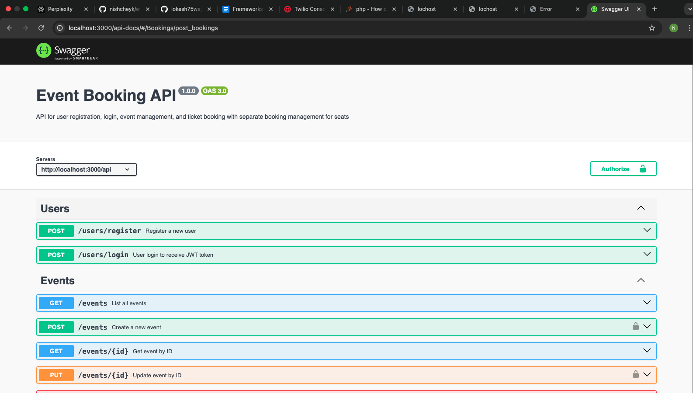
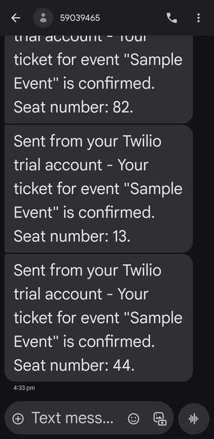
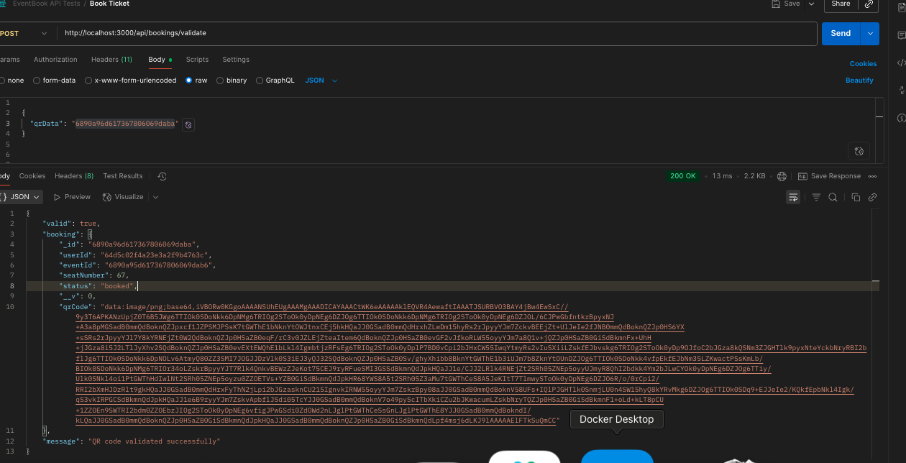
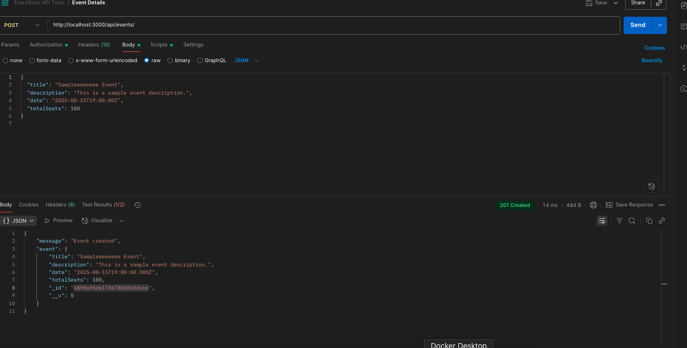
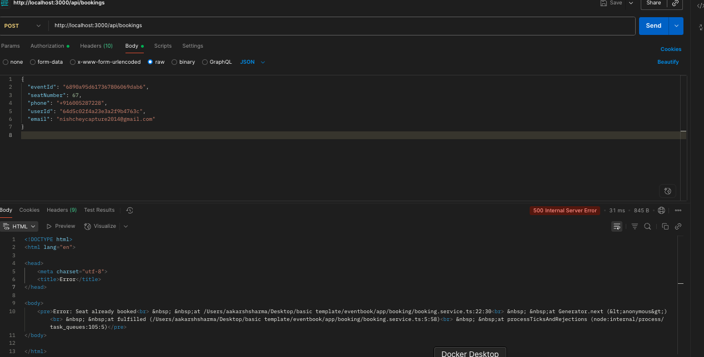
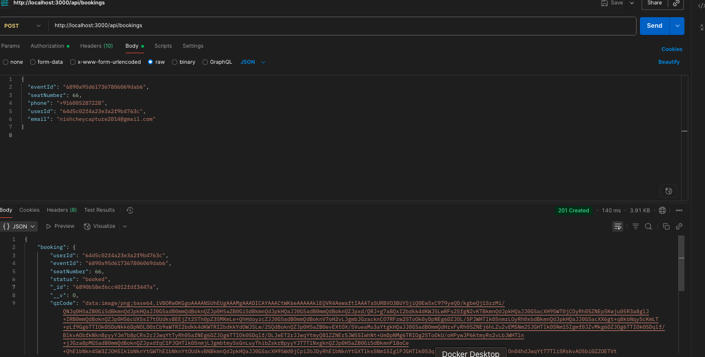

# Event Booking API


## Introduction


The Event Booking API is a scalable, secure backend solution built with Node.js, TypeScript, Express, and MongoDB. It enables users to register, authenticate, manage events, book seats with individual seat selection, and generate QR code tickets for secure validation. Designed to handle high concurrency and provide multi-channel notifications via email and SMS, it is suitable for a wide range of event types such as concerts, workshops, and conferences.


---


## Technology Stack

### Backend
- **Node.js & Express**: Backend server and routing framework for building scalable APIs.
- **TypeScript**: Adds static typing for safer and more maintainable code.

### Database
- **MongoDB with Mongoose**: NoSQL database with schema enforcement and indexing.

### Authentication & Security
- **JWT (JSON Web Tokens)**: Token-based authentication for secure access control.
- **bcryptjs**: Password hashing for storing credentials securely.
- **express-rate-limit**: Rate limiting middleware to protect critical routes like login and registration from brute-force attacks.

### Middleware & Utilities
- **express-async-handler**: Simplifies async error handling in Express routes.
- **qrcode npm package**: Generates encrypted QR codes for tickets.

### Notifications
- **Nodemailer (SMTP)**: Sends transactional emails (e.g., booking confirmations).
- **Twilio API**: Sends SMS notifications for real-time alerts.
- **Redis with Bull queue**: Manages background job queues for sending notifications efficiently and reliably.

### Documentation & Deployment
- **Swagger UI**: Provides interactive API documentation.
- **Docker & Docker Compose**: Containerizes the application for consistent deployment across environments.


---


## Backend Schema Design


### User Schema


- Stores `username`, `email`, and `passwordHash` (hashed securely using bcryptjs).  
- Supports JWT-based authentication for secure access.


### Event Schema


- Contains event details: `title`, `description`, `venue`, `date`, `time`, `totalSeats`.  
- Avoids embedding seat arrays to maintain document size constraints and scalability.


### Booking Schema


- Every ticket booking is a document storing `eventId`, `seatNumber`, `userId`, `status`, and `qrCodeData`.  
- Enforced uniqueness via a **compound index on `(eventId, seatNumber)`** to prevent double bookings and enable fast seat availability lookups.


---


## API Endpoints Overview
Endpoint	Method	Description
```
/api/users/register	POST	Register a new user
/api/users/login	POST	Authenticate user and return JWT token
/api/events	GET	List all events
/api/events	POST	Create a new event (requires authentication)
/api/events/:id	GET	Get details of a specific event
/api/bookings	POST	Book a seat on an event (requires authentication)
/api/bookings/validate	POST	Validate a ticket using QR code data

```
---


## QR Code Validation Endpoint (`POST /api/bookings/validate`)


This endpoint verifies scanned ticket QR codes at event entry points.


**Process:**
- Receives encrypted QR code data from scanning devices.  
- Decrypts and queries the booking's existence and status.  
- Returns validation result indicating if the ticket is valid, already used, or invalid.  

---


## Notifications


- **Email:** Booking confirmations sent asynchronously using Nodemailer configured with SMTP.  
- **SMS:** Twilio API used for immediate SMS alerts to customers.  
- Credentials are securely managed with environment variables, and error/ retry mechanisms ensure reliability.


---
<p align="center">
  
</p>
<p align="center">
  
</p>
<p align="center">
  
</p>
<p align="center">
  
</p>
<p align="center">
  
</p>
<p align="center">
  
</p>


[▶️ Watch the video](https://drive.google.com/file/d/1r0hr-rzcdfxdgPkJOZF6sihW6S7R_fcD/view?usp=sharing)


## Challenges Faced & Solutions


### 1. Concurrency and Double Booking Prevention
- **Challenge:** Multiple users trying to book the same seat simultaneously led to conflicts.  
- **Solution:** Implemented MongoDB compound indexing on `(eventId, seatNumber)` allowing atomic existence checks before booking insertion, ensuring no double bookings.


### 2. MongoDB Document Size Limits
- **Challenge:** Embedding all seats inside event documents caused document size overflow and slow performance.  
- **Solution:** Separated seat bookings into an independent collection, enabling scalability and easier concurrency management.


### 3. Native Module Issues in Docker
- **Challenge:** Native modules like `bcrypt` caused Docker build failures and runtime errors.  
- **Solution:** Switched to `bcryptjs`, a pure JavaScript implementation, and ensured rebuilds of native modules during Docker builds where necessary.


### 4. Handling Large QR Code Payloads
- **Challenge:** Large QR codes complicated communication over email/SMS and database storage.  
- **Solution:** Sent encrypted user or booking IDs as compact QR code data, minimizing payload size while maintaining security and validation integrity.


### 5. Notification Deliverability and Reliability
- **Challenge:** Ensuring email and SMS reliably reach users despite network issues and service constraints.  
- **Solution:** Integrated Nodemailer and Twilio with robust error handling, retries, and credential security to maintain high delivery success rates.


### 6. Async Error Handling Complexity
- **Challenge:** Manual try/catch blocks in every async route led to verbose, repetitive code.  
- **Solution:** Adopted `express-async-handler` middleware to automatically catch and forward asynchronous errors to centralized error middleware, improving maintainability and clarity.

---
## Rate Limiting (Protecting Authentication Endpoints)

To prevent brute force attacks and limit unnecessary requests on critical endpoints like `/register` and `/login`, a rate limiter is implemented using the `express-rate-limit` package:
```
import { Router } from 'express';
import rateLimit from 'express-rate-limit';
import { registerController, loginController } from "./users.controller";

const router = Router();

const authRateLimiter = rateLimit({
windowMs: 15 * 60 * 1000, // 15 mins
max: 5, // limit each IP to 5 requests per windowMs
message: {
status: 429,
error: "Too many requests from this IP, please try again after 15 minutes"
},
standardHeaders: true,
legacyHeaders: false,
});

router.post('/register', authRateLimiter, registerController);
router.post('/login', authRateLimiter, loginController);

export default router;

```

This middleware protects the register and login routes by restricting them to 5 requests per 15 minutes per IP address, mitigating abuse and brute force attacks.

---

## How to Run

### Using Docker (Recommended)

1. Clone the repository and install dependencies:
```
git clone https://github.com/nishcheyk/eventbook
cd event-booking-api
npm install
```


2. Set up environment variables in `.env`:
```
MONGO_URL=mongodb://mongo:27017/eventbook_db
JWT_SECRET=your_jwt_secret_key
PORT=3000
SMTP_HOST=smtp.gmail.com
SMTP_PORT=587
SMTP_USER=your-email@example.com
SMTP_PASS=your-email-password
MAIL_FROM="Event Booking your-email@example.com"
TWILIO_SID=your_twilio_sid
TWILIO_AUTH_TOKEN=your_twilio_auth_token
TWILIO_PHONE=your_twilio_phone
```

3. Run the application with Docker:  
```
rm -rf node_modules
docker-compose up --build
```

4. Access the API:  
```
- REST endpoints: `http://localhost:3000/api`  
- Swagger UI docs: `http://localhost:3000/api-docs`
```
---

### Without Docker (Local Development)

1. Clone the repository and install dependencies:  
```
git clone https://github.com/nishcheyk/eventbook
cd event-booking-api
npm install
```


2. Install bcryptjs to avoid native bcrypt build issues:  
```
npm install bcryptjs
```


3. Set up environment variables in `.env` (create a `.env` file in the root folder):  
```
MONGO_URL=mongodb://localhost:27017/eventbook_db
JWT_SECRET=your_jwt_secret_key
PORT=3000
SMTP_HOST=smtp.gmail.com
SMTP_PORT=587
SMTP_USER=your-email@example.com
SMTP_PASS=your-email-password
MAIL_FROM="Event Booking your-email@example.com"
TWILIO_SID=your_twilio_sid
TWILIO_AUTH_TOKEN=your_twilio_auth_token
TWILIO_PHONE=your_twilio_phone
```

4. Start the server locally:  
```
npm start
```
text

5. The server will be running at
```
- REST endpoints: `http://localhost:3000/api`  
- Swagger UI docs: `http://localhost:3000/api-docs`
```

**Note:**  
- Replace placeholders with your actual credentials in the `.env` file.    
- Ensure you have a local MongoDB instance running when not using Docker.

## Router and Middleware Example
```
import { Router } from "express";
import authMiddleware from "../common/middleware/auth.middleware";
import { registerController, loginController } from "./users.controller";
import { createEventController, listEvents, eventDetails } from "./event.controller";
import { bookTicket, validateQRCode } from "./booking.controller";

const userRouter = Router();
userRouter.post("/register", authRateLimiter, registerController);
userRouter.post("/login", authRateLimiter, loginController);

const eventRouter = Router();
eventRouter.get("/", listEvents);
eventRouter.get("/:id", eventDetails);
eventRouter.post("/", authMiddleware, createEventController);

const bookingRouter = Router();
bookingRouter.post("/", authMiddleware, bookTicket);
bookingRouter.post("/validate", validateQRCode);

const mainRouter = Router();
mainRouter.use("/users", userRouter);
mainRouter.use("/events", eventRouter);
mainRouter.use("/bookings", bookingRouter);

export default mainRouter;

```
---

## API Documentation

Accessible and interactive Swagger UI documentation is available at `/api-docs` to explore and test all API endpoints.

---

## Conclusion

This Event Booking API balances robust schema design, high concurrency handling, secure authentication, real-time notifications, and clean error management. It is fully containerized for rapid deployment and scaling, providing a solid foundation for event ticketing platforms. The integrated rate limiting middleware enhances security by mitigating abusive requests on critical authentication endpoints.

---

## Repository

Source code and setup instructions are available at:  
[https://github.com/nishcheyk/eventbook](https://github.com/nishcheyk/eventbook)
